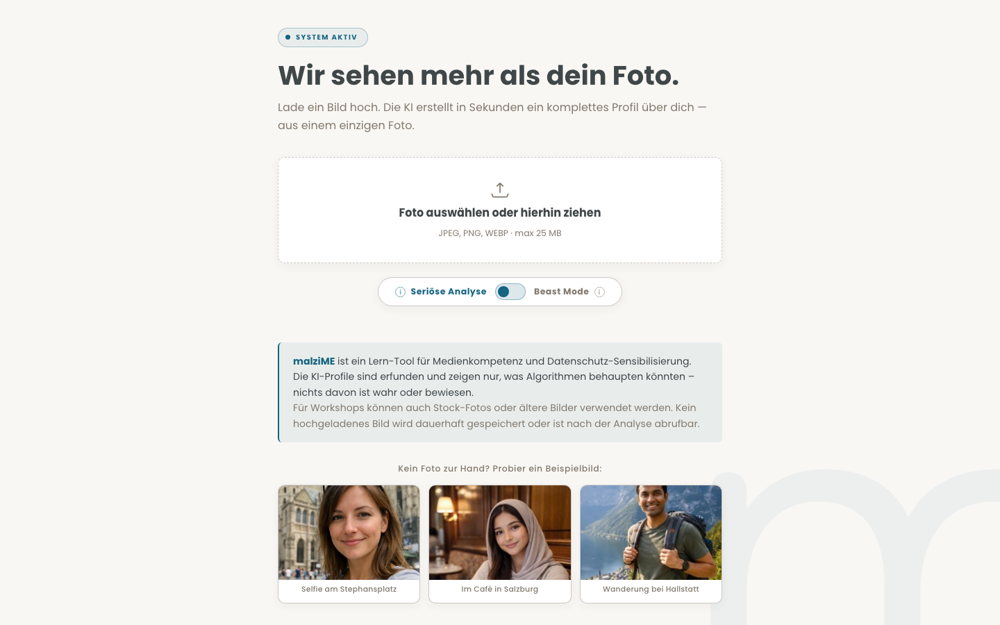
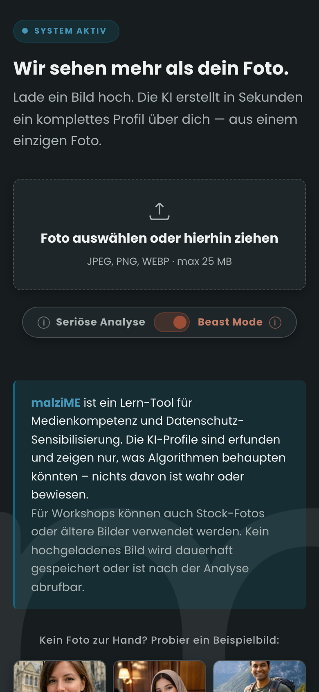

# malziME — Was KI aus deinem Foto liest

[](https://github.com/malziland/malzime/blob/main/LICENSE)
[](https://malzi.me)

[](https://github.com/malziland/malzime/actions/workflows/ci.yml)
[](https://github.com/malziland/malzime/actions/workflows/ci.yml)
[](https://github.com/malziland/malzime/actions/workflows/ci.yml)
[](https://github.com/malziland/malzime/actions/workflows/ci.yml)
[](https://github.com/malziland/malzime/actions/workflows/ci.yml)

> **[malzi.me](https://malzi.me)** — Jetzt ausprobieren

Workshop-Tool fuer Medienkompetenz und Datenschutz-Sensibilisierung. Zeigt Teilnehmer:innen, was KI-Algorithmen aus einem einzigen Foto ableiten koennten — inklusive Persoenlichkeitsprofil, Werbe-Targeting und Manipulationstrigger.

**Alles erfunden. Nichts davon ist wahr oder bewiesen.**

<p align="center">
  
</p>
<p align="center">
  
</p>

## Features

- **Zwei Modi**: Serioese Analyse (sachlich) und Beast Mode (uebertrieben-provokant)
- **Datenwert-Rechner**: Zeigt was ein Profil fuer Datenbroker wert ist
- **Privacy-Check**: Erkennt ungewollt preisgegebene Informationen (Telefonnummern, Adressen, Kennzeichen)
- **EXIF-Analyse**: Zeigt versteckte Kamera-Metadaten (client-seitig extrahiert)
- **GPS-Karte**: Zeigt den Aufnahmeort auf einer Karte (GPS verlässt nie den Browser)
- **Easter Egg**: Tierfotos bekommen ein lustiges Spass-Profil
- **PDF-Export**: Ergebnisse als PDF speichern (fuer Workshop-Diskussionen)
- **Demo-Fotos**: 3 anklickbare KI-generierte Demo-Fotos (keine realen Personen, siehe `public/img/demo/LICENSE.md`) mit Fake-EXIF fuer Workshops (echte KI-Analyse, kein vorgefertigtes Ergebnis)
- **Mehrsprachig**: i18n-System fuer UI, Prompts und Tierprofile (Deutsch + Englisch aktiv)
- **Wartungsmodus**: Admin-gesteuerter Wartungsmodus mit rotem Warn-Modal (blockiert Seite komplett)
- **Queue-Architektur**: Cloud-Tasks-Warteschlange faengt Workshop-Lastspitzen ab (seit v2.0)
- **Kein Tracking**: Keine Cookies, keine Analytics, keine Werbung, keine dauerhafte Speicherung

## Architektur

```
public/                     Firebase Hosting (SPA, kein Build-Schritt)
  index.html                Hauptseite
  app.js                    Entry Point (ES Module)
  js/                       Frontend-Module (api, client-context, demo, dom, error-logger, exif, geocoding, i18n, render, state, stats, telemetry-logger, ui)
  locales/                  Frontend-Locale-Dateien (de.json, manifest.json)
  styles.css                malziland Design System (Hell/Dunkel via Beast-Mode-Kopplung) + Print Styles
  __tests__/                Vitest Frontend-Tests
  impressum.html            Impressum
  datenschutz.html          Datenschutzerklaerung
  stats.html                Oeffentliche Nutzungsstatistik
  fonts/                    Self-hosted: Poppins (woff2, OFL)
  lib/leaflet/              Self-hosted: Leaflet 1.9.4
  lib/exifr/                Self-hosted: exifr lite (EXIF-Parsing im Browser)

functions/src/              Firebase Cloud Functions (2nd Gen, Node 24, europe-west1)
  index.js                  Cloud-Function-Exports + Firebase Secret Bindings
  config.js                 Konstanten + Mistral-Modell-IDs + Limits
  handle-analyze.js         Synchrone Analyse-Pipeline (Mistral-only)
  handle-admin.js           Admin-Endpunkte (Boost, Reset, Maintenance)
  handle-stats.js           Stats-Endpunkt
  handle-errors.js          Anonymes Client-Fehler-Logging (whitelist-validiert, keine PII, severity ERROR)
  handle-telemetry.js       Anonyme Success-/Performance-Telemetrie (Spiegel zu handle-errors.js, severity INFO)
  handle-enqueue.js         Queue: Job anlegen + in Cloud Tasks einreihen
  handle-process-job.js     Queue: Worker — claimt Job, ruft Mistral, schreibt Ergebnis
  handle-job-status.js      Queue: Status-Polling + Liveness-Herzschlag
  handle-reap.js            Queue: Reaper fuer verlassene / haengende / abgelaufene Jobs
  jobs.js                   Queue: Job-Lebenszyklus (Firestore-Collection `jobs`)
  cloud-tasks.js            Queue: Cloud-Tasks-Anbindung (+ Lokal-Shim fuer Emulator)
  queue-storage.js          Queue: temporaere Bild-Ablage im GCS-Bucket
  feature-flags.js          Laufzeit-Feature-Flag `useQueue` (Firestore, 30s-Cache)
  mistral-mock.js           Mistral-Mock fuer Emulator-Lasttests (QUEUE_LOCAL)
  mistral.js                Mistral AI: aktiv Single-Large-Call (Large erstellt Beschreibung + beide Profile); 3-Call-Hybrid (Large Describe + Small Profile) als Fallback
  json-repair.js            Defensiver JSON-Parser fuer LLM-Outputs (4-Stufen-Repair)
  throttle.js               In-Memory-Semaphore gegen Mistral-Bursts (aktiv: jeder Mistral-Call laeuft durch die Drossel)
  heartbeat.js              Chunked-Response-Heartbeat: haelt lange Analyse-Antworten offen (Safari kappt Streams nach ~47 s)
  animal.js                 SUBJECT-Klassifikation + Tier-Easter-Egg-Profile aus Mistral-Beschreibung
  privacy.js                OCR-Privacy-Risiken aus Mistrals "Sichtbarer Text"
  counter.js                Firestore-Zaehler: Stundenlimit, Totals, Stats, Boost, Reset, Maintenance
  auth.js                   HMAC-basierte Admin-Token + Nonces
  domains.js                Zentrale CORS-/Origin-Whitelist
  notify.js                 ntfy Push-Benachrichtigungen bei Limit-Erreichung
  middleware.js             Rate Limiting (IP-basiert, 500/10min), IP-Extraktion
  upload.js                 Multipart- und JSON-Body-Parsing
  i18n.js                   Backend-Locale-Loader (loadPrompts, loadAnimals, resolveLanguage)
  locales/                  Backend-Locale-Dateien (de/prompts.js, de/animals.js, en/..., manifest.json)
  __tests__/                Jest Unit-Tests + fixtures/ fuer json-repair
  scripts/                  Dev-Tools (test-subject.js, load-test-malzime.js, queue-emulator-loadtest.js)
```

## Queue-Architektur (v2.0)

Workshop-Last ist stossweise: 25 Uploads in zwei Minuten. Damit kein Upload an den Rate-Limits des KI-Anbieters scheitert, laeuft die Analyse seit v2.0 ueber eine Warteschlange:

- **`/api/enqueue`** legt einen Job an und reiht ihn in **Google Cloud Tasks** ein. Das Bild liegt waehrenddessen kurz in einem dedizierten EU-Storage-Bucket.
- Cloud Tasks dispatcht die Jobs **dosiert** an den Worker (`processJob`) — die Anbieter-Limits werden so strukturell eingehalten statt im Fehlerfall abgefangen.
- Der Browser pollt **`/api/job-status`**; jeder Poll ist zugleich ein Liveness-Herzschlag. Verlaesst der Nutzer die Seite, wird der Job verworfen, bevor er einen KI-Call kostet.
- Das Bild wird unmittelbar nach der Verarbeitung geloescht, das Job-Dokument (inkl. Ergebnis) spaetestens nach 2 h.

Umgeschaltet wird ueber das Firestore-Feature-Flag `useQueue` — ohne Deploy, jederzeit auf den synchronen `/analyze`-Pfad zurueckschaltbar.

## Privacy-Architektur

Datenschutz ist kein Feature — es ist das Fundament:

- **EU-Hosting fuer KI-Analysen**: Alle Bild-Analysen laufen ueber Mistral AI (Paris, EU-DSGVO). Mistral als Auftragsverarbeiter nach Art. 28 DSGVO. Auf dem genutzten kostenpflichtigen API-Tier ist Training auf Eingaben/Ausgaben laut Anbieter-Zusage deaktiviert.
- **Keine US-KI-Anbieter mehr**: Seit v1.6.0 wurden Google Vertex AI und Cloud Vision aus der Pipeline entfernt. Google bleibt nur fuer die Infrastruktur (Firebase Hosting + Cloud Functions + Firestore, alles in `europe-west1`).
- **EXIF-Extraktion im Browser**: exifr parsed die Metadaten lokal, GPS verlässt nie den Client
- **Server bekommt kein GPS**: Nur komprimiertes Bild + Kamera-Hersteller/Modell (ohne GPS, ohne dateTimeOriginal)
- **Geocoding direkt vom Browser**: Nominatim wird client-seitig aufgerufen, nicht ueber den Server
- **Keine dauerhafte Speicherung**: Im Queue-Betrieb liegt das Bild nur kurz zur Verarbeitung im EU-Storage und wird sofort danach geloescht; das Job-Dokument spaetestens nach 2 h. Kein Profil bleibt dauerhaft gespeichert
- **Keine externen Scripts**: Alle Assets self-hosted (Fonts, Leaflet, exifr). Kein Google Fonts CDN, kein unpkg, kein reCAPTCHA, kein Firebase SDK
- **Bot-Schutz ohne Tracking**: Rate Limiting (IP), Honeypot-Feld, Timing-Check
- **Strenge CSP**: Nur `self` + OpenStreetMap Tiles + Nominatim + `api.malzi.me` (eigener Sync-Endpunkt)

## Schnellstart

```bash
# 1. Repo klonen
git clone https://github.com/malziland/malzime.git
cd malzime

# 2. Firebase CLI installieren (falls noch nicht vorhanden)
npm i -g firebase-tools
firebase login

# 3. Dependencies installieren
npm install                          # Frontend-Tests (Vitest)
cd functions && npm install && cd .. # Backend

# 4. Lokal testen
firebase emulators:start --only functions,hosting

# 5. Deploy
firebase deploy --only functions,hosting
```

Detaillierte Anleitung: [`docs/SETUP.md`](docs/SETUP.md) | Eigene Instanz aufsetzen: [`docs/SELF-HOSTING.md`](docs/SELF-HOSTING.md) | Betrieb & Rollback: [`docs/RUNBOOK.md`](docs/RUNBOOK.md)

## API

`POST /analyze` — JSON oder multipart/form-data

### Request (JSON)

```json
{
  "imageBase64": "...",
  "mimeType": "image/jpeg",
  "filename": "upload.jpg",
  "exif": { "make": "Apple", "model": "iPhone 15 Pro" },
  "lang": "de",
}
```

| Feld | Typ | Beschreibung |
|------|-----|--------------|
| `imageBase64` | string | Base64-kodiertes Bild (client-seitig komprimiert) |
| `mimeType` | string | `image/jpeg`, `image/png`, `image/webp`, `image/gif` |
| `exif` | object | Kamera-Metadaten vom Client (ohne GPS!) |
| `lang` | string | Sprachcode (`de`, `en`, ...). Default: `de` |

### Response

```json
{
  "profiles": {
    "normal": {
      "categories": {},
      "ad_targeting": [],
      "manipulation_triggers": [],
      "profileText": ""
    },
    "boost": { "..." }
  },
  "privacyRisks": [],
  "exif": {},
  "meta": {
    "requestId": "abc12345",
    "mode": "multimodal"
  }
}
```

`mode` kann sein: `multimodal`, `animal`, `blocked`

Bei Tieren enthalten `profiles.normal` und `profiles.boost` ein lustiges Easter-Egg-Profil.
Bei blockierten Bildern ist `profiles: null` und `blockedReason` enthaelt den Grund.

### Queue-Endpunkte (v2.0)

Im Queue-Betrieb (Feature-Flag `useQueue`) nutzt das Frontend statt `/analyze` zwei Endpunkte:

- **`POST /api/enqueue`** — gleicher Request-Body wie `/analyze`. Antwort: `{ "jobId": "..." }`
- **`GET /api/job-status?jobId=...`** — Antwort: `{ "status": "...", "queuePosition": 0, "etaSeconds": 0, "result": { ... } }`. `status` ist `queued`, `processing`, `done`, `failed` oder `abandoned`; `result` ist gesetzt, sobald `status` `done` ist (gleiche Struktur wie die `/analyze`-Response).

## Sicherheit

- **Content Security Policy** mit strikter Whitelist (`self` + OpenStreetMap Tiles + Nominatim + `api.malzi.me`)
- **HSTS** mit Preload
- **X-Frame-Options: DENY**
- **X-Content-Type-Options: nosniff**
- **Magic-Byte-Validierung**: Server prueft JPEG/PNG/WebP/GIF-Header
- **Honeypot-Feld** gegen Bots
- **Rate Limiting**: 500 Requests / 10 Minuten pro IP
- **Timing-Check**: Requests innerhalb von 2s nach Seitenaufruf werden verzoegert
- **Prompt-Injection-Schutz**: User-Daten in XML-Tags isoliert + escapeXml() auf dynamische Inhalte
- **HMAC-Admin-Tokens**: Kurzlebige signierte Tokens (30 Min) + Nonces (5 Min) fuer Admin-Aktionen
- **Stundenlimit**: Rollendes 60-Minuten-Fenster (500 Analysen/Stunde, anonyme Timestamps in Firestore)
- **Keine dauerhafte Datenspeicherung**: Bilder nur kurz zur Verarbeitung gehalten, Job-Daten spaetestens nach 2 h geloescht, kein Logging von Bilddaten

## Tests

```bash
# Backend (Jest, 439 Tests)
cd functions && npm test

# Frontend (Vitest + jsdom, 165 Tests)
npm run test:frontend

# E2E (Playwright, 5 Tests)
npm run test:e2e

# Coverage
cd functions && npm run test:coverage
npm run test:frontend:coverage

# Linting
cd functions && npm run lint           # Backend ESLint
npm run lint:frontend                  # Frontend ESLint
cd functions && npm run format:check   # Backend Prettier
npm run format:frontend:check          # Frontend Prettier
```

**Backend (439 Tests):** HTTP-Handler, Admin-Endpunkte, Stats-Handler, HMAC-Auth, Nonce-Flow, Tier-Erkennung (SUBJECT-basiert), Config, Counter, Middleware (Rate Limiting), Privacy-Risiken (aus Mistrals "Sichtbarer Text"), Upload-Parsing, Magic-Byte-Validierung, XML-Escaping, ntfy-Benachrichtigungen, i18n-Guardian, Mistral-Integration (Mock-Tests), JSON-Repair (4-stufig), Throttle-Semaphore, Queue (Job-Lebenszyklus, Reaper, Feature-Flag, Cloud-Tasks-Anbindung, Abhol-Ticket).

**Frontend (165 Tests):** DOM-Helpers, State, Scan-Animation, Disclaimer-Modal, Limit-Banner, Maintenance-Modal, Geocoding, Render-Pipeline, API-Integration (synchron + Queue), Queue-Reload-Wiederherstellung, Stats-Seite, i18n-Modul, i18n-Guardian.

**E2E (5 Tests):** Playwright — Smoke-Tests (Demo-Flow, fehlerfreies Laden), axe-A11y-Gate (Startseite + Profil-Ansicht) und Tastatur-Durchlauf.

## CI/CD

GitHub Actions Workflow `.github/workflows/ci.yml`:

- **Tests + Lint** bei jedem Push und Pull Request (Backend + Frontend)
- **Secret-Scan** via gitleaks (prueft auf versehentlich committete API-Keys)
- **Dependabot** prueft monatlich auf unsichere Dependencies (npm + GitHub Actions)
- **npm audit** im Backend-Job (blockiert bei hohen und kritischen Schwachstellen)
- **Branch Protection** fuer `main`: Merges erst nach gruenen Status-Checks (`test-backend`, `test-frontend`, `test-e2e`, `secret-scan`)
- Deploy erfolgt manuell per `npx firebase deploy`

## Tech-Stack

| Komponente | Technologie |
|-----------|-------------|
| Hosting | Firebase Hosting (Google Ireland, europe-west1) |
| Backend | Firebase Cloud Functions (2nd Gen, Node 24, europe-west1) |
| Queue | Google Cloud Tasks (dosierter Job-Dispatch, europe-west1) |
| Datenbank | Cloud Firestore (Zaehler, Maintenance-Flag, Queue-Jobs, europe-west1) |
| KI-Analyse (aktiv) | Mistral Large (multimodal, Paris/EU) — ein Single-Call erstellt Bildbeschreibung + beide Profile |
| KI-Fallback | Klassische 3-Call-Pipeline (Large beschreibt, Small profiliert), per Feature-Flag umschaltbar |
| Karten | Leaflet + OpenStreetMap (self-hosted Lib + OSM-Tiles) |
| Geocoding | Nominatim (client-seitig, OpenStreetMap Foundation) |
| EXIF-Parsing | exifr (client-seitig im Browser) |
| Fonts | Poppins (self-hosted, woff2, OFL) |
| i18n | Eigenes Micro-Modul (Frontend JSON + Backend CommonJS Locales) |
| Frontend | Vanilla JS, kein Framework, kein Build-Schritt |

## Einschraenkungen

- **Mistral-Abh&auml;ngigkeit**: Wenn Mistral nicht erreichbar ist, schlaegt die Analyse fehl (keine Fallback-Provider mehr seit v1.6.0). Der User sieht eine `blocked.apiError`-Antwort. Mistrals SLA + Multi-Region-Setup machen das selten.
- **Safety-Filter**: Mistrals Sicherheitsfilter koennen die Bildbeschreibung bei sensiblen Inhalten blockieren. In dem Fall sieht der User `blocked.safetyFilter`.
- **SUBJECT-Klassifikation**: Tier-Easter-Egg-Profile werden ueber die `SUBJECT:`-Kopfzeile in Mistrals Antwort und Keyword-Matching im Beschreibungstext bestimmt (siehe `animal.js`). Bei Unsicherheit faellt die Pipeline auf den normalen Profil-Pfad zur&uuml;ck.
- **Alters-Schaetzung**: erfolgt ausschliesslich durch Mistral anhand physischer Merkmale. Seit v1.5.0 mit zwei Anker-Bloecken in den Prompts: Koerperproportionen (Schulter-zu-Kopf, Hand) als primaere Achse fuer Kinder/Teens, plus Zwangs-Mapping fuer Erwachsene (sichtbare Falten/Lid-Erschlaffung/Pigmentflecken haben Mindest-Alter-Schwellen).

## Datenschutz

- Keine dauerhafte Speicherung: Bilder werden nur kurz zur Verarbeitung gehalten und sofort geloescht, Job-Daten spaetestens nach 2 h
- Keine Tracking-Cookies, keine Analytics, keine Werbung
- Kein Firebase SDK im Frontend, kein reCAPTCHA
- KI-Analyse ausschliesslich ueber Mistral AI (Paris/EU). Mistral als Auftragsverarbeiter nach Art. 28 DSGVO, kein Training auf den Daten.
- Infrastruktur (Hosting, Cloud Functions, Firestore) bei Google Ireland in europe-west1 — auch als Auftragsverarbeiter, kein Zugriff auf Bildinhalte.
- GPS-Daten verlassen nie den Browser des Nutzers
- Details: [malzi.me/datenschutz](https://malzi.me/datenschutz)

## Lizenz

Der Quellcode steht unter MIT — siehe [LICENSE](LICENSE).

**Ausnahme Markenzeichen:** Die malziland-/malziME-Logos und Markendateien unter
`public/img/brand/` sind **nicht** von der MIT-Lizenz umfasst. Alle Rechte vorbehalten;
Nutzung ausserhalb dieses Projekts nur mit schriftlicher Zustimmung von
malziland - learning | training | consulting e.U. Details: [TRADEMARKS.md](TRADEMARKS.md).

**Schriften:** Poppins ist unter der SIL Open Font License 1.1 lizenziert
(OFL-Text liegt im Ordner `public/fonts/poppins/`).

---

Erstellt von [malziland - learning | training | consulting e.U.](https://malziland.at) &mdash; Inhaber: [Christoph Krieger](https://www.linkedin.com/in/christophkrieger/) &middot; Live unter [malzi.me](https://malzi.me)
