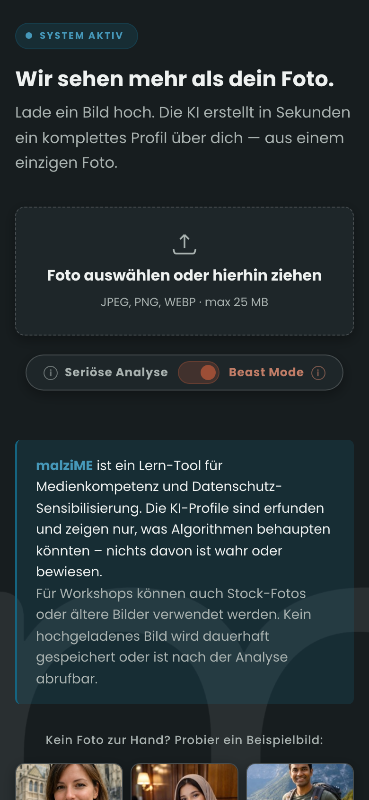

# malziME — Was KI aus deinem Foto liest

[](https://github.com/malziland/malzime/blob/main/LICENSE)
[](https://malzi.me)

[](https://github.com/malziland/malzime/actions/workflows/ci.yml)
[](https://github.com/malziland/malzime/actions/workflows/ci.yml)
[](https://github.com/malziland/malzime/actions/workflows/ci.yml)
[](https://github.com/malziland/malzime/actions/workflows/ci.yml)
[](https://github.com/malziland/malzime/actions/workflows/ci.yml)

> **[malzi.me](https://malzi.me)** — Jetzt ausprobieren

Workshop-Tool fuer Medienkompetenz und Datenschutz-Sensibilisierung. Zeigt Teilnehmer:innen, was KI-Algorithmen aus einem einzigen Foto ableiten koennten — inklusive Persoenlichkeitsprofil, Werbe-Targeting und Manipulationstrigger.

**Alles geraten. Nichts davon ist wahr oder bewiesen.**

<p align="center">
  
</p>
<p align="center">
  
</p>

## Features

- **Zwei Modi**: Serioese Analyse (sachlich) und Beast Mode (uebertrieben-provokant)
- **Datenwert-Rechner**: Zeigt was ein Profil fuer Datenbroker wert ist
- **Privacy-Check**: Erkennt ungewollt preisgegebene Informationen (Telefonnummern, Adressen, Kennzeichen)
- **EXIF-Analyse**: Zeigt versteckte Kamera-Metadaten (client-seitig extrahiert)
- **GPS-Karte**: Zeigt den Aufnahmeort auf einer Karte (GPS-Daten erreichen nie unsere Server; bei einem hochgeladenen Foto lädt der Browser die Karte direkt bei OpenStreetMap, bei den Demo-Fotos kommt ein fester Kartenausschnitt aus der Seite selbst)
- **Easter Egg**: Tierfotos bekommen ein lustiges Spass-Profil
- **PDF-Export**: Ergebnisse als PDF speichern (fuer Workshop-Diskussionen)
- **Demo-Fotos**: 3 anklickbare KI-generierte Demo-Fotos (keine realen Personen, siehe `public/img/demo/LICENSE.md`) mit Fake-EXIF fuer Workshops (echte KI-Analyse, kein vorgefertigtes Ergebnis)
- **Mehrsprachig**: i18n-System fuer UI, Prompts und Tierprofile (Deutsch + Englisch aktiv)
- **Wartungsmodus**: Admin-gesteuerter Wartungsmodus mit rotem Warn-Modal (blockiert Seite komplett)
- **Queue-Architektur**: Cloud-Tasks-Warteschlange faengt Workshop-Lastspitzen ab (seit v2.0)
- **Kein Tracking**: Keine Cookies, keine Analytics, keine Werbung, keine dauerhafte Speicherung

## Architektur

```
public/                     Firebase Hosting (SPA, kein Build-Schritt)
  index.html                Hauptseite
  app.js                    Entry Point (ES Module)
  js/                       Frontend-Module (Liste und Aufgaben: docs/ARCHITECTURE.md, Abschnitt Frontend)
  locales/                  Frontend-Locale-Dateien (de.json, en.json, manifest.json)
  styles.css                malziland Design System (Hell/Dunkel via Beast-Mode-Kopplung) + Print Styles
  __tests__/                Vitest Frontend-Tests
  impressum.html            Impressum
  datenschutz.html          Datenschutzerklaerung
  stats.html                Oeffentliche Nutzungsstatistik
  fonts/                    Self-hosted: Poppins (woff2, OFL)
  lib/leaflet/              Self-hosted: Leaflet 1.9.4
  lib/exifr/                Self-hosted: exifr lite (EXIF-Parsing im Browser)
  lib/libheif/              Self-hosted: libheif 1.23.6 + libde265 1.1.3 (HEIC-Dekoder, WebAssembly, LGPL; selbst gebaut, scripts/libheif-bauen.sh)

functions/src/              Firebase Cloud Functions (2nd Gen, Node 24, europe-west1)
  index.js                  Cloud-Function-Exports + Firebase Secret Bindings
  oeffentliche-huelle.js    Gilt fuer jede oeffentliche Schnittstelle: kein Zwischenspeichern der Antwort, gepackte Anfragen abweisen
  config.js                 Was bewusst nicht einstellbar ist: Mistral-Modell-IDs, EU-Endpunkt, EU-Datenbank, Upload-Grenze, Dateiformate
  db.js                     Firestore-Zugang (benannte Datenbank malzime-eu)
  betriebsprofil.js         Betriebswerte aus Firestore (config/betriebsprofil): Felder, Grenzen, Cache
  betriebsprofil-kopplung.js  Welche Werte eines Einstellungssatzes zusammenpassen muessen
  produktiv-satz.js         Betriebswerte fuer den echten Betrieb (Quelle fuer config/betriebsprofil)
  test-satz.js              Einstellungssatz fuer die Tests
  handle-admin.js           Admin-Endpunkte (Boost, Reset, Maintenance)
  handle-stats.js           Stats-Endpunkt
  handle-errors.js          Anonymes Client-Fehler-Logging (whitelist-validiert, keine PII, severity ERROR)
  handle-telemetry.js       Anonyme Success-/Performance-Telemetrie (ohne Geraeteangaben, severity INFO)
  meldungs-annahme.js       Gemeinsame Pruefungen der zwei Annahmestellen fuer Meldungen des Browsers
  handle-enqueue.js         Queue: Job anlegen, Bild ablegen, in Cloud Tasks einreihen
  handle-process-job.js     Queue: Worker — claimt Job, ruft Mistral, schreibt Ergebnis
  handle-job-status.js      Queue: Status-Polling + Liveness-Herzschlag; Abmelden eines wartenden Auftrags
  handle-reap.js            Queue: Reaper fuer verlassene / haengende / abgelaufene Jobs
  ruecknahme.js             Queue: gibt zurueck, was ein nie analysierter Auftrag belegt (Platz im Stundenfenster, Foto)
  jobs.js                   Queue: Job-Lebenszyklus (Firestore-Collection `jobs`)
  analyse-ausgang.js        Queue: welche Fehlermeldung ein Endzustand zeigt, und die eine Fehlerzeile dazu
  warteschlangen-rechnung.js  Queue: die eine Rechnung fuer Einlassgrenze und Wartezeit-Ansage
  durchsatz.js              Gemessene Analysedauer (Wartezeit-Ansage, Einlassgrenze)
  cloud-tasks.js            Queue: Cloud-Tasks-Anbindung (+ Lokal-Shim fuer Emulator)
  queue-storage.js          Queue: temporaere Bild-Ablage im GCS-Bucket
  feature-flags.js          Laufzeit-Feature-Flags aus Firestore (30s-Cache)
  lokale-schalter.js        Schalter nur fuer lokale Laeufe (Attrappe, lokale Warteschlange, stumme Benachrichtigung): wirken nie in der Produktion
  mistral-mock.js           Mistral-Mock fuer Emulator-Lasttests (QUEUE_LOCAL)
  mistral.js                Mistral AI: ein Aufruf an Large erstellt Beschreibung + beide Profile, ein zweiter ohne Bild die Beast-Werbung
  mistral-http.js           Netzschicht zu Mistral: Zeitgrenzen, Wiederholung bei Ueberlast, Antwort als Strom
  mistral-antwort.js        Auswertung der KI-Antwort: Live-Text, fehlende Karten, Maskierung
  ueberlast.js              Wartezeiten und Wiederholung bei 429/502/503/504
  verbindungsfehler.js      Verbindungsabriss zu einem fremden Dienst: einmal neu versuchen, Teiltext retten, Grund ohne Adressen protokollieren
  json-repair.js            Defensiver JSON-Parser fuer LLM-Outputs (4-Stufen-Repair)
  throttle.js               In-Memory-Semaphore gegen Mistral-Bursts (aktiv: jeder Mistral-Call laeuft durch die Drossel)
  job-pipelines.js          Der Analyseweg: KI-Aufruf, Tier-Easter-Egg, Beast-Werbung, Kinderschutz
  job-helfer.js             Kleine Entscheidungen im Analyseablauf (Schalter, Fehlerarten)
  animal.js                 Motiv-Entscheidung am Feld `subject` der KI-Antwort + Tier-Easter-Egg-Profile
  privacy.js                Privacy-Risiken: lesbare Adresse und Telefonnummer aus dem Feld `visible_text` der KI-Antwort, Kennzeichen aus dem ganzen Text
  minor-safety.js           Kinderschutz-Filter fuer Werbekategorien (Schwelle mit Puffer)
  minor-safety-woerter.js   Wortlisten des Kinderschutz-Filters (reine Daten, deutsch und englisch; mit Wortfuge fuer zusammengesetzte Woerter)
  alters-lesbarkeit.js      Erkennung nicht lesbarer Altersangaben (erster Satz, Altersversuch)
  alters-auslese.js         Altersauslese: Zahlwoerter, Kategorien, untere und obere Altersgrenze
  alters-lesbarkeit-woerter.js  Woerter, Kategorien und Abkuerzungen der Altersauslese (reine Daten)
  counter.js                Firestore-Zaehler: Stundenlimit, Totals, Stats, Boost, Reset, Maintenance
  middleware.js             Rate Limiting (IP-basiert, Grenze und Fenster aus dem Einstellungssatz), IP-Extraktion
  upload.js                 Multipart- und JSON-Body-Parsing
  auth.js                   HMAC-basierte Admin-Token + Nonces
  domains.js                Zentrale CORS-/Origin-Whitelist
  notify.js                 ntfy Push-Benachrichtigungen bei Limit-Erreichung
  kapazitaets-wache.js      Meldet, wenn Einstellungssatz und Warteschlange auseinanderlaufen
  laufzeit-wache.js         Meldet, wenn Analysen an ihre Zeitgrenze stossen
  handle-erinnerung.js      Wochenlauf: ntfy-Push vor Ablauf der halbjaehrlichen ZDR-Nachpruefung (mit Anleitung)
  erinnerungs-waechter.js   Meldet, wenn die Wochen-Erinnerung ausbleibt
  zusagen.js                Gemeinsame Fristlogik fuer datierte Zusagen (Erinnerung + CI-Waechter)
  i18n.js                   Backend-Locale-Loader (loadPrompts, loadAnimals, resolveLanguage)
  locales/                  Backend-Locale-Dateien (de/prompts.js, de/animals.js, en/..., manifest.json)
  __tests__/                Jest Unit-Tests + fixtures/ fuer json-repair
  scripts/                  Dev-Tools (queue-emulator-loadtest.js — Lasttest gegen den Emulator)
```

## Queue-Architektur (v2.0)

Workshop-Last ist stossweise: 25 Uploads in zwei Minuten. Damit kein Upload an den Rate-Limits des KI-Anbieters scheitert, laeuft die Analyse seit v2.0 ueber eine Warteschlange:

- **`/api/enqueue`** legt einen Job an, legt danach das Bild kurz in einem dedizierten EU-Storage-Bucket ab und reiht den Job in **Google Cloud Tasks** ein. Erst der Auftrag, dann das Foto: So liegt nie ein Foto im Zwischenspeicher, das kein Auftrag kennt.
- Cloud Tasks dispatcht die Jobs **dosiert** an den Worker (`processJob`) — die Anbieter-Limits werden so strukturell eingehalten statt im Fehlerfall abgefangen.
- Der Browser pollt **`/api/job-status`**; jeder Poll ist zugleich ein Liveness-Herzschlag. Verlaesst der Nutzer die Seite, wird der Job verworfen, bevor er einen KI-Call kostet. Waehlt jemand ein anderes Foto, meldet die Seite den noch wartenden Job sofort ab (`DELETE /api/job-status`).
- Das Bild wird unmittelbar nach der Verarbeitung geloescht, das Job-Dokument (inkl. Ergebnis) spaetestens nach 2 h.

Seit v2.10 ist die Warteschlange der einzige Weg. Der frühere synchrone `/analyze`-Pfad — eine 30-60 s offene Verbindung — ist entfernt: Er war seit Mai 2026 nur noch Rückfall und hätte bei Stoßlast genau das Problem zurückgebracht, wegen dem die Warteschlange gebaut wurde. Als Notfall-Hebel dient stattdessen der Wartungsmodus (siehe [`docs/RUNBOOK.md`](docs/RUNBOOK.md)).

## Privacy-Architektur

Datenschutz ist kein Feature — es ist das Fundament:

- **EU-Hosting fuer KI-Analysen**: Alle Bild-Analysen laufen ueber Mistral AI (Paris, EU-DSGVO). Mistral als Auftragsverarbeiter nach Art. 28 DSGVO. Auf dem genutzten kostenpflichtigen API-Tier ist Training auf Eingaben/Ausgaben laut Anbieter-Zusage deaktiviert.
- **Keine US-KI-Anbieter mehr**: Seit v1.6.0 wurden Google Vertex AI und Cloud Vision aus der Pipeline entfernt. Google bleibt nur fuer die Infrastruktur: Datenverarbeitung (Cloud Functions, Cloud Storage, Firestore) in `europe-west1`, statische Seiten ueber ein weltweites Auslieferungsnetz (CDN).
- **EXIF-Extraktion im Browser**: exifr parsed die Metadaten lokal, GPS erreicht nie unsere Server
- **Server bekommt kein GPS**: Nur komprimiertes Bild + Kamera-Hersteller/Modell (ohne GPS, ohne dateTimeOriginal)
- **Geocoding direkt vom Browser**: Nominatim wird client-seitig aufgerufen, nicht ueber den Server
- **Keine dauerhafte Speicherung**: Im Queue-Betrieb liegt das Bild nur kurz zur Verarbeitung im EU-Storage und wird sofort danach geloescht; das Job-Dokument spaetestens nach 2 h. Kein Profil bleibt dauerhaft gespeichert
- **Keine externen Scripts**: Alle Assets self-hosted (Fonts, Leaflet, exifr, libheif). Kein Google Fonts CDN, kein unpkg, kein reCAPTCHA, kein Firebase SDK
- **Bot-Schutz ohne Tracking**: Rate Limiting (IP), Honeypot-Feld, Timing-Check
- **Strenge CSP**: Nur `self` + OpenStreetMap Tiles + Nominatim + die Cloud-Run-Adressen der eigenen Schnittstellen in `europe-west1` (einzeln genannt, kein Platzhalter)

## Schnellstart

```bash
# 1. Repo klonen
git clone https://github.com/malziland/malzime.git
cd malzime

# 1b. Einmalig einrichten — setzt den Push-Riegel und prueft die Werkzeuge.
#     Ohne diesen Schritt laeuft die Vorabpruefung NICHT vor einem Push.
sh scripts/einrichten.sh

# 2. Firebase CLI installieren (falls noch nicht vorhanden)
npm i -g firebase-tools
firebase login

# 3. Dependencies installieren
npm install                          # Frontend-Tests (Vitest)
cd functions && npm install && cd .. # Backend

# 4. Lokal testen (Functions, Firestore, Hosting, Pub/Sub — Ablauf: docs/QUEUE-EMULATOR.md)
cp functions/.env.local.example functions/.env.local   # einmalig: Attrappe statt echter KI
npm run emulator

# 5. Deploy (Riegel, Trockenlauf, Live-Smoke — Ablauf in docs/RUNBOOK.md)
./scripts/deploy.sh
```

Detaillierte Anleitung: [`docs/SETUP.md`](docs/SETUP.md) | Eigene Instanz aufsetzen: [`docs/SELF-HOSTING.md`](docs/SELF-HOSTING.md) | Betrieb & Rollback: [`docs/RUNBOOK.md`](docs/RUNBOOK.md)

## API

Jede Analyse laeuft ueber zwei Endpunkte — Bild einreihen, Ergebnis abholen:

`POST /api/enqueue` — JSON mit dem Bild als `imageBase64`. Antwort: `{ "jobId": "...", "resultToken": "..." }`.
`resultToken` ist das Abhol-Ticket: Nur wer es mitschickt, bekommt das Ergebnis.

`GET /api/job-status?jobId=...&token=...` — Antwort: `{ "status": "...", "position": 0, "etaSeconds": 0, "result": { ... } }`.
`status` ist `queued`, `processing`, `done`, `failed` oder `abandoned`. Status und
Position gibt es auch ohne Ticket; `result` ist gesetzt, sobald `status` `done` ist
und das Ticket stimmt.

Jede Statusabfrage ist zugleich ein Lebenszeichen: Verlaesst der Nutzer die
Seite, wird der Job verworfen, bevor er einen KI-Aufruf kostet.

`DELETE /api/job-status?jobId=...&token=...` — meldet einen Job ab, den der Browser
nicht mehr abholt. Wirkt nur mit dem Abhol-Ticket und nur, solange der Job wartet:
kein KI-Aufruf, der Platz im Stundenlimit kommt zurueck, das Bild wird geloescht.
Antwort: `{ "verworfen": true }` oder `{ "verworfen": false }`.

### Request (JSON)

```json
{
  "imageBase64": "...",
  "mimeType": "image/jpeg",
  "filename": "upload.jpg",
  "exif": { "make": "Apple", "model": "iPhone 15 Pro" },
  "lang": "de"
}
```

| Feld          | Typ    | Beschreibung                                         |
| ------------- | ------ | ---------------------------------------------------- |
| `imageBase64` | string | Base64-kodiertes Bild (client-seitig komprimiert)    |
| `mimeType`    | string | `image/jpeg`, `image/png`, `image/webp`, `image/gif` |
| `exif`        | object | Kamera-Metadaten vom Client (ohne GPS!)              |
| `lang`        | string | Sprachcode (`de`, `en`, ...). Default: `de`          |

### Response

```json
{
  "profiles": {
    "normal": {
      "categories": {},
      "ad_targeting": [],
      "manipulation_triggers": [],
      "profileText": ""
    },
    "boost": { "..." }
  },
  "privacyRisks": [],
  "exif": {},
  "meta": {
    "requestId": "abc12345",
    "mode": "multimodal"
  }
}
```

`mode` kann sein: `multimodal`, `animal`, `blocked`

Bei Tieren enthalten `profiles.normal` und `profiles.boost` ein lustiges Easter-Egg-Profil.
Bei blockierten Bildern ist `profiles: null` und `blockedReason` enthaelt den Grund.

### Wiederaufnahme

Die Job-Nummer liegt im Browser (`sessionStorage`), das Ergebnis serverseitig
rund zwei Stunden. Bricht die Verbindung ab oder wird das Geraet gesperrt,
laeuft der Job weiter — die Seite holt das Ergebnis nach, sobald sie
zurueckkehrt, und ein Neuladen funktioniert ebenfalls.

## Sicherheit

Das vollständige Sicherheitsmodell — Schutzgüter, Bedrohungsbild und vor allem
die **bewusst getroffenen Abwägungen mit Begründung** — steht in
[docs/SECURITY-MODEL.md](docs/SECURITY-MODEL.md). Die wichtigsten Schichten:

- **Content Security Policy** mit strikter Whitelist (`self`; Bilder zusätzlich von OpenStreetMap-Kacheln, Verbindungen zusätzlich zu Nominatim und zu den Cloud-Run-Adressen der eigenen Schnittstellen in `europe-west1`)
- **HSTS** — Transportverschlüsselung erzwungen, zwei Jahre, inklusive Unterdomains; die
  `preload`-Angabe wird mitgeliefert, ein Eintrag in der Browser-Liste ist bewusst nicht
  erfolgt (Begründung: `docs/SECURITY-MODEL.md`)
- **X-Frame-Options: DENY**
- **X-Content-Type-Options: nosniff**
- **Magic-Byte-Validierung**: Server prueft JPEG/PNG/WebP/GIF-Header
- **Honeypot-Feld** gegen Bots
- **Rate Limiting** pro IP, **Stundenlimit** ueber ein rollendes Fenster (anonyme
  Timestamps in Firestore), **HMAC-Admin-Tokens** mit kurzer Gueltigkeit und
  **befristete Aufbewahrung** von Job-Daten. Die Zahlenwerte dieser vier Grenzen
  stehen im Einstellungssatz und sind hier bewusst nicht wiederholt — sie waeren
  sonst nach der ersten Umstellung falsch. Der geltende Stand steht in
  [docs/BETRIEBSPROFILE.md](docs/BETRIEBSPROFILE.md).
- **Timing-Check**: Requests innerhalb von 2s nach Seitenaufruf werden verzoegert
- **Prompt-Injection-Schutz**: User-Daten in XML-Tags isoliert + escapeXml() auf dynamische Inhalte
- **Keine dauerhafte Speicherung von Bilddaten**: Bilder werden nur zur Verarbeitung
  gehalten und danach geloescht, Bildinhalte nie protokolliert

### Was sich zur Laufzeit aendern laesst — und was ausdruecklich nicht

Die Betriebswerte (Zeitgrenzen, Limits, Kapazitaet, Fristen) liegen in Firestore
und lassen sich im laufenden Betrieb umstellen. Das ist gewollt: Ein KI-Anbieter
wird langsamer, ein Workshop ist groesser als geplant — dann muss eine Zahl
nachziehen koennen, ohne eine Auslieferung von fuenfundzwanzig Minuten.

**Genau deshalb duerfen bestimmte Werte dort nicht stehen.** Ein Eintrag in der
Datenbank laesst sich in Sekunden aendern: ohne Commit, ohne Review, ohne Spur im
offenen Quelltext. Stuende dort der KI-Endpunkt, koennte ein einziger
Schreibzugriff die Bildanalyse still auf einen Server ausserhalb der EU umlenken —
waehrend die Website weiter dasselbe verspricht, der Quelltext hier unveraendert
bleibt und die Pruefsummen unter `malzi.me/build-info.json` weiter stimmen. Der
Bruch waere von aussen nicht nachweisbar.

Im Code bleiben deshalb: **EU-Endpunkt**, **EU-Datenbank** (`malzime-eu`), die
**benannten KI-Modelle**, die **Upload-Obergrenze**, die **erlaubten Dateiformate**
und die **gekuerzten Feldlaengen der Fehlerprotokolle**. Alles davon traegt eine
Zusage an die Teilnehmenden und muss den Weg ueber Commit, Pruefkette und
Veroeffentlichung nehmen.

Zwei Mechanismen halten die Trennung aufrecht:

1. Der Einstellungssatz kann diese Werte **nicht versehentlich uebernehmen** —
   gelesen werden ausschliesslich die bekannten Zahlenfelder, alles andere im
   Dokument wird ignoriert.
2. `scripts/pruefe-doppelte-werte.py` geht **vom Code aus** und verlangt fuer jede
   Zahlenkonstante eine von zwei Antworten: Sie steht in der Datenbank (dann darf
   sie im Code nicht noch einmal stehen), oder sie traegt eine ausgeschriebene
   Begruendung `BLEIBT IM CODE — <Grund>`. Alles andere haelt die Auslieferung an.
   Die Pruefung laeuft in der Pipeline und vor jedem Push.

### Fuenf Waechter gegen teure Umbauten

Ein Umbau des Einstellungssatzes am 30.08.2026 erzeugte 39 Fundstellen. Nicht
weil der Code schlecht waere, sondern weil eine Aenderung dieser Art weit
ausstrahlt — und weil nirgends stand, was zusammengehoert. Fuenf Waechter halten
das jetzt fest:

`scripts/pruefe-mitzieher.py` beantwortet die Frage **"wenn du X aenderst,
gehoert Y mitgezogen"**. Ein neues Pflichtfeld im Einstellungssatz braucht vier
weitere Stellen; eine neue Cloud Function einen Eintrag im Alarm-Filter; eine
neue Seite unter `public/` ihre Eintraege in beiden Sprachdateien. Jede Regel
nennt, was passiert,
wenn man sie vergisst — eine Meldung ohne Grund wird irgendwann weggeklickt.

`scripts/pruefe-kopplung.py` meldet, wenn Dateien **wieder zusammenwachsen**.
Die Grenzen sind der gemessene Stand, aufgerundet: eine Sperrklinke, von hier
aus nur noch abwaerts. Sie verbieten nichts, sie verlangen eine Entscheidung —
teilen oder die Grenze bewusst anheben und danebenschreiben, warum.

Alle laufen in der Pipeline und vor jedem Push. Alle melden **"nicht
messbar"** statt stillschweigend gruen, wenn ihre Grundlage fehlt.

## Tests

Alle Suiten laufen automatisiert in der CI bei jedem Push und Pull Request
([GitHub Actions](https://github.com/malziland/malzime/actions)) — der
verbindliche Stand ist immer der letzte CI-Lauf, deshalb stehen hier bewusst
keine festen Testzahlen.

```bash
# Backend (Jest)
cd functions && npm test

# Frontend (Vitest + jsdom)
npm run test:frontend

# E2E (Playwright)
npm run test:e2e

# Coverage
cd functions && npm run test:coverage
npm run test:frontend:coverage

# Linting
cd functions && npm run lint           # Backend ESLint
npm run lint:frontend                  # Frontend ESLint
cd functions && npm run format:check   # Backend Prettier
npm run format:frontend:check          # Frontend Prettier
```

**Backend:** HTTP-Handler, Admin-Endpunkte, Stats-Handler, HMAC-Auth, Nonce-Flow, Tier-Erkennung (SUBJECT-basiert), Config, Counter, Middleware (Rate Limiting), Privacy-Risiken (aus dem Feld `visible_text` der KI-Antwort), Upload-Parsing, Magic-Byte-Validierung, XML-Escaping, ntfy-Benachrichtigungen, i18n-Guardian, Mistral-Integration (Mock-Tests), JSON-Repair (4-stufig), Throttle-Semaphore, Queue (Job-Lebenszyklus, Reaper, Feature-Flag, Cloud-Tasks-Anbindung, Abhol-Ticket).

**Frontend:** DOM-Helpers, State, Scan-Animation, Limit-Banner, Maintenance-Modal, Geocoding, Render-Pipeline, API-Integration, Warteschlange samt Wiederaufnahme, Stats-Seite, i18n-Modul, i18n-Guardian.

**E2E:** Playwright — Smoke-Tests (Demo-Flow, fehlerfreies Laden), axe-A11y-Gate (Startseite + Profil-Ansicht) und Tastatur-Durchlauf.

## CI/CD

GitHub Actions Workflow `.github/workflows/ci.yml`:

- **Tests + Lint** bei jedem Push und Pull Request (Backend + Frontend)
- **Secret-Scan** via gitleaks (prueft auf versehentlich committete API-Keys)
- **Dependabot** prueft monatlich auf Updates (npm + GitHub Actions, je Bereich zu einem PR gebuendelt) und oeffnet bei gemeldeten Sicherheitsluecken sofort einen Reparatur-PR
- **Audit-Gate** im Backend-Job (`scripts/audit-gate.mjs`): blockiert bei hohen und kritischen Schwachstellen. Laesst sich eine Luecke tief in einer fremden Abhaengigkeitskette nachweislich (noch) nicht reparieren, kann sie **begruendet und mit Ablaufdatum** in `.github/audit-allowlist.json` ausgenommen werden — danach faellt das Gate von selbst wieder auf rot
- **Pruefungen** (`pruefungen`, alle blockierend): verbotene Formulierungen in Aussentexten (`.pruefungen/aussentext.txt`), Zahlen mit mehr als einem Wert (`.pruefungen/fakten.txt`), stille Fehlschlaege in Skripten, Tests ohne Zusicherung. Der Job prueft zuerst die Pruefungen selbst — je Pruefung eine Probe gegen kaputtes und eine gegen sauberes Material. Die genaue Probenzahl steht bewusst nur im Skript und wird von `selbstpruefung.sh` gezaehlt, nicht hier (sonst driftet sie)
- **Branch Protection** fuer `main`: Merges erst nach allen gruenen Pflicht-Checks. Kanonische Quelle ist `gh api repos/malziland/malzime/branches/main/protection` (Stand 2026-08-13: sechs Checks inkl. `playwright-version` und `pruefungen`, `enforce_admins: true`)
- Deploy erfolgt manuell ueber `scripts/deploy.sh` (Riegel, Trockenlauf, Live-Smoke; Ablauf in `docs/RUNBOOK.md`), nie direkt per `firebase deploy`

## Tech-Stack

| Komponente         | Technologie                                                                                                                  |
| ------------------ | ---------------------------------------------------------------------------------------------------------------------------- |
| Hosting            | Firebase Hosting — Projektregion Google Ireland (europe-west1), Auslieferung der statischen Dateien ueber ein weltweites CDN |
| Backend            | Firebase Cloud Functions (2nd Gen, Node 24, europe-west1)                                                                    |
| Queue              | Google Cloud Tasks (dosierter Job-Dispatch, europe-west1)                                                                    |
| Datenbank          | Cloud Firestore (Zaehler, Maintenance-Flag, Queue-Jobs, europe-west1)                                                        |
| KI-Analyse (aktiv) | Mistral Large (multimodal, Paris/EU) — ein Single-Call erstellt Bildbeschreibung + beide Profile                             |
| Karten             | Leaflet + OpenStreetMap (self-hosted Lib + OSM-Tiles)                                                                        |
| Geocoding          | Nominatim (client-seitig, OpenStreetMap Foundation)                                                                          |
| EXIF-Parsing       | exifr (client-seitig im Browser)                                                                                             |
| Fonts              | Poppins (self-hosted, woff2, OFL)                                                                                            |
| i18n               | Eigenes Micro-Modul (Frontend JSON + Backend CommonJS Locales)                                                               |
| Frontend           | Vanilla JS, kein Framework, kein Build-Schritt                                                                               |

## Einschraenkungen

- **Mistral-Abh&auml;ngigkeit**: Wenn Mistral nicht erreichbar ist, schlaegt die Analyse fehl (keine Fallback-Provider mehr seit v1.6.0). Der User sieht eine `blocked.apiError`-Antwort. Mistrals SLA + Multi-Region-Setup machen das selten.
- **Safety-Filter**: Verweigert Mistral bei sensiblen Inhalten die Analyse, liefert die Antwort keine Profile; der User sieht `blocked.profileBlocked` (bzw. `blocked.apiError`, wenn der Aufruf selbst scheitert).
- **SUBJECT-Klassifikation**: Ob ein Tier-Easter-Egg-Profil gezeigt wird, entscheidet allein das Feld `subject` in Mistrals Antwort; welche Tierart es zeigt, bestimmt Keyword-Matching im Beschreibungstext (siehe `animal.js`). Fehlt das Feld oder ist es ungueltig, laeuft der normale Profil-Pfad.
- **Alters-Schaetzung**: erfolgt ausschliesslich durch Mistral anhand physischer Merkmale. Seit v1.5.0 mit zwei Anker-Bloecken in den Prompts: Koerperproportionen (Schulter-zu-Kopf, Hand) als primaere Achse fuer Kinder/Teens, plus Zwangs-Mapping fuer Erwachsene (sichtbare Falten/Lid-Erschlaffung/Pigmentflecken haben Mindest-Alter-Schwellen).

## Datenschutz

- Keine dauerhafte Speicherung: Bilder werden nur kurz zur Verarbeitung gehalten und sofort geloescht, Job-Daten spaetestens nach 2 h
- Keine Tracking-Cookies, keine Analytics, keine Werbung
- Kein Firebase SDK im Frontend, kein reCAPTCHA
- KI-Analyse ausschliesslich ueber Mistral AI (Paris/EU). Mistral als Auftragsverarbeiter nach Art. 28 DSGVO, kein Training auf den Daten.
- Datenverarbeitung (Cloud Functions, Cloud Storage, Firestore) bei Google Ireland in europe-west1; statische Seiten ueber ein weltweites CDN. Google als Auftragsverarbeiter, kein Zugriff auf Bildinhalte.
- GPS-Daten erreichen nie unsere Server (Karte und Ortsname holt der Browser bei einem hochgeladenen Foto direkt bei OpenStreetMap bzw. Nominatim; bei den Demo-Fotos fragt er nichts an)
- Details: [malzi.me/datenschutz](https://malzi.me/datenschutz)

## Laeuft wirklich, was hier offen liegt?

Offener Quelltext sagt, was laufen KOENNTE — nicht, was laeuft. Fuer das
Frontend, auf dem die Datenschutz-Zusagen dieses Projekts beruhen, ist die
Luecke geschlossen:

Bei jedem Ausliefern entsteht [`/build-info.json`](https://malzi.me/build-info.json)
mit dem Commit, dem Zeitpunkt und einer SHA-256-Pruefsumme **jeder** ausgelieferten
Datei. Wer nachrechnen will, braucht einen Befehl:

```
sh scripts/pruefe-live.sh
```

Das Skript holt den Fingerabdruck von malzi.me und bildet aus dem dort genannten
Commit **selbst** die Liste der Dateien, die ausgeliefert sein muessen — die Liste
des Servers allein genuegt nicht, er koennte eine veraenderte Datei einfach
weglassen. Dann laedt es jede dieser Dateien vom Server und vergleicht sie mit dem
Fingerabdruck und mit dem Inhalt des Commits; die Pruefsummen des Server-Pakets
(das Programm, `package.json`, `package-lock.json`, die Sprachliste — alles, was
an Google uebergeben wird) haelt es gegen denselben Commit. Eine Datei, die im Fingerabdruck fehlt, ist ein
Befund. Rueckgabewerte sind bewusst getrennt: `0` deckungsgleich und gegen den
genannten Commit nachgerechnet, `1` Abweichung gefunden, `2` Messproblem (kein
Netz, Werkzeug fehlt — oder der genannte Commit liess sich nicht gegenrechnen,
etwa in einer veralteten Kopie oder ausserhalb eines Repositories) — ein
Messfehler darf nie als Befund durchgehen und nie als bestandene Pruefung.

Was das NICHT beweist: was auf dem Server passiert. Die Cloud Functions baut
Google aus dem Quelltext; eine nachrechenbare Bestaetigung dafuer gibt es nicht.
Der Teil, der beweisbar ist, ist beweisbar gemacht.

## Lizenz

Der Quellcode steht unter MIT — siehe [LICENSE](LICENSE).

**Ausnahme Markenzeichen:** Die malziland-/malziME-Logos und Markendateien unter
`public/img/brand/` sind **nicht** von der MIT-Lizenz umfasst. Alle Rechte vorbehalten;
Nutzung ausserhalb dieses Projekts nur mit schriftlicher Zustimmung von
malziland - learning | training | consulting e.U. Details: [TRADEMARKS.md](TRADEMARKS.md).

**Fremde Bestandteile:** Leaflet (BSD 2-Clause), exifr (MIT), der HEIC-Dekoder
libheif mit libde265 (LGPL 3.0, als getrennte, austauschbare Datei) und die Schrift
Poppins (SIL Open Font License 1.1) liegen selbst gehostet im Repository und sind
**nicht** von der MIT-Lizenz dieses Projekts umfasst. Jeder Bestandteil bringt
seinen eigenen Lizenztext mit; die Uebersicht steht in
[THIRD-PARTY.md](THIRD-PARTY.md).

**OpenStreetMap:** Bei einem hochgeladenen Foto kommen Kartenkacheln und Adressaufloesung
zur Laufzeit direkt vom Browser der Besucher. Im Repository liegt OSM-Material nur
fuer die Demo-Fotos: feste Kartenausschnitte und Adressen ihrer erfundenen Orte
(`public/img/demo/LICENSE.md`); sie sind **nicht** von der MIT-Lizenz umfasst. Die
Namensnennung mit Verweis auf die Lizenzseite steht in der Karte selbst.

---

Erstellt von [malziland - learning | training | consulting e.U.](https://malziland.at) &mdash; Inhaber: [Christoph Krieger](https://www.linkedin.com/in/christophkrieger/) &middot; Live unter [malzi.me](https://malzi.me)
